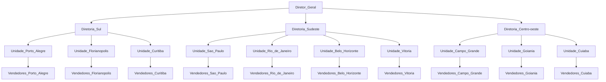

# MVP de teste: Recrutamento e Seleção - Janeiro de 2023.

## Disclaimer

As características que definem um programador entre junior/pleno/sênior não são exatas e geralmente vem mixadas tanto de capacidades técnicas como de responsabilidades e softskills, formando assim um conjunto de dados únicos de cada profissional/empresa. Um mesmo desenvolvedor pode ser considerado sênior na empresa X e pleno na empresa Y. As competências variam muito.

Esta fase do processo de seleção da **CONVICTI** visa estabelecer uma linha de referência a respeito dos conhecimentos e capacidades técnicas necessárias para o recrutamento de desenvolvedores variando de nível pleno para sênior, por isso, caso você não tenha as habilidades necessárias para desenvolvimento deste projeto ou acredite se tratar de um teste extenso, entenderemos.

## Divisão de responsabilidades

Você **NÃO** deve tentar desenvolver o sistema inteiro. Trabalhamos com divisão clara de tarefas entre Backend/Frontend e App Mobile, sendo assim, concentre-se em fazer a parte do teste que concerne à área para a qual você aplicou para a seleção. Nos itens abaixo você encontrará instruções para cada uma delas e o que esperaremos na sua entrega.

## ` -- Desenvolvedor Mobile React Native Pleno~Sênior `

Como desenvolvedor React Native desse projeto, utilizando TypeScript e as demais ferramentas que julgar adequadas:

* Use sua criatividade para desenhar as telas, como julgar mais adequado, desenvolvendo um aplicativo Mobile em React Native que atenda **satisfatóriamente** os requisitos e casos de uso dispostos no **documento de especificação** do projeto, atendendo os itens que fazem sentido SOMENTE para o App Mobile;

  ### O que avaliaremos:
  * Entendimento e atendimento das funcionalidades descritas no *documento de especificação* especialmente quanto à sincronização com o backend de dados produzidos offline;
  * Uso de API de mapas para exibir as infos de posição das vendas;
  * Organização estrutural do código fonte do sistema;
  * Organização de commits e comentários;
  * Documentação explicativa de preparação de ambiente de desenvolvimento (para que o próximo dev rode e continue o projeto).

  ### Diferenciais: 
  * Aplicação de design patterns, solid e clean code;
  * Utilização de testes automatizados.
  * DESAFIO: A API de backend possui 2 endpoints para o cadastro de vendas. Um deles recebe latitude, longitude e valor da venda, fazendo o cálculo da regra de roaming no backend para salvar essa info no DB. 
  O outro endpoint recebe latitude, longitude, valor da venda e o campo adicional de roaming. Se você tiver com tempo disponível e quiser se desafiar, siga as regras do projeto e envie também a informação de roaming já calculada pelo próprio aplicativo. **ATENÇÃO:** Fazer o cálculo de roaming no App é completamente opcional.

## Sobre o projeto (Objetivo)

O objetivo geral do sistema é servir como ferramenta de controle regional de vendas, proporcionando uma interface onde os vendedores, através de seus celulares, possam efetuar os lançamentos das vendas.

Os gerentes por sua vez, através de seus computadores via navegador, podem acompanhar o desempenho somente de seus vendedores.

Os diretores, através de seus computadores via navegador, podem acompanhar o desempenho somente das unidades que pertencem à sua diretoria enquanto o diretor nacional pode acompanhar pelo computador via navegador o desempenho de vendas de todas as unidades e diretorias.

Uma funcionalidade MUITO IMPORTANTE é que o sistema identifica quando uma venda de um vendedor é feita em uma localização física mais próxima a uma OUTRA unidade qualquer, do que a unidade à qual o vendedor está vinculado, "tagueando" assim essa venda como "roaming".

## Hierarquia de dados (vide excel)

## Documentos anexos
Documento de Especificação: https://github.com/convicti/teste-dev-rn-022023/raw/main/docs/documento-especificacao.pdf

Dados do Projeto: https://github.com/convicti/teste-dev-rn-022023/raw/main/docs/dados-do-projeto.xlsx

## URL da API de Backend
Api Docs: https://api.testfront.cvti.cloud/docs

Postman Docs: https://api.testfront.cvti.cloud/documentation

## Observações
Este repositório será constantemente atualizado com novas informações no *documento de especificação*, incluindo respostas de perguntas feitas pelos participantes do processo seletivo bem como itens "fora do escopo" caso seja necessário.

## IMPORTANTE!
  * Este teste trata-se de modelo fictício de sistema, os códigos fontes produzidos são de propriedade dos candidatos, não sendo permitido à **CONVICTI Tecnologia** o uso do mesmos, que não para fins de avaliação do desenvolvedor. 
  * Ficam os desenvolvedores candidatos livres para usarem seus testes em seus portfólios como desejarem, sendo vedada somente a reprodução dos documentos presentes neste repositório.
  * Os desenvolvedores que completarem a entrega de todas as funcionalidades do teste, no prazo estipulado, mas que por motivos diversos não forem contratados, poderão ser ressarcidos com um valor simbólico, referente ao tempo de trabalho para implementação do teste.
